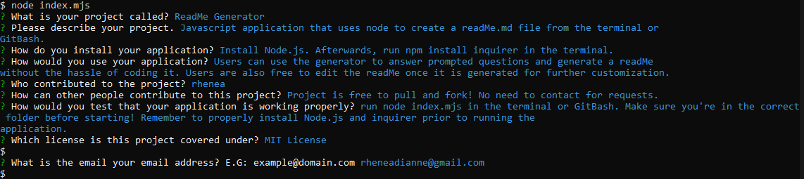

# readMe Generator

    
## Table of Contents
- [Description](#descriptioN)
- [Installation](#installation)
- [Usage](#usage)
- [Contributions](#contributions)
- [Contributing](#contributing)
- [Tests](#tests)
- [Questions](#questions)

## Descriptions
Javascript application that uses node to create a readMe.md file from the terminal or GitBash.

## Installation
Install Node.js. Afterwards, run npm install inquirer in the terminal.

## Usage 
Users can use the generator to answer prompted questions and generate a readMe without the hassle of coding it. Users are also free to edit the readMe once it is generated for further customization.

## Contributing 
Project is free to pull and fork! No need to contact for requests.

## Tests
run node index.mjs in the terminal or GitBash. Make sure you're in the correct folder before starting! Remember to properly install Node.js and inquirer prior to running the application.

## Screenshots and Tutorial video

Tutorial Video:
https://user-images.githubusercontent.com/104535318/178125654-66b52ecc-e833-4eb4-94d3-2976070b4df5.mp4

## GitHub and Contact
GitHub: [github.com/rheneadianne](https://github.com/rheneadianne)
Email:  [rheneadianne@gmail.com](mailto:rheneadianne@gmail.com)

## Contribution
Made with ❤️ by rhenea 
